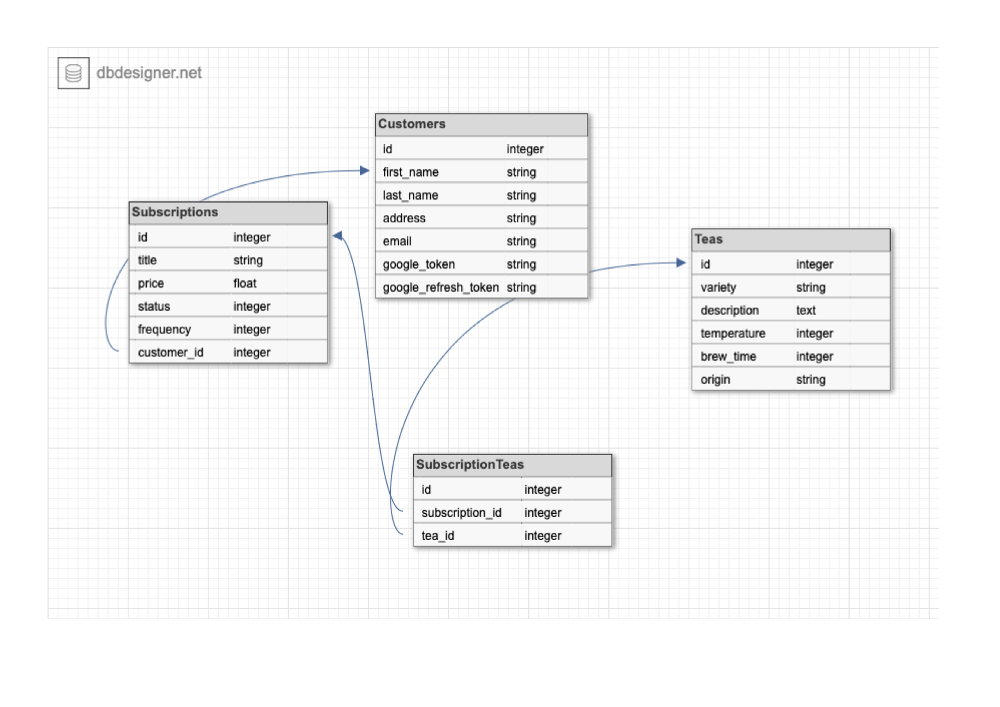

# Table of Contents
- [Overview](#overview)
- [Installation](#installation)
- [Endpoints](#endpoints)

---

## Overview

The Tea Subscription API is a REST API which allows users to create and manage subscriptions (weekly, monthly, or bi-monthly) for delivieries of tea. 


---

## Installation

This API is built using

`Ruby 2.7.2` and `Rails 5.2.6`

To run this API locally clone down this repository and run `bundle install`

---

## Endpoints

* ### Create Subscription

```
POST /api/v1/customers/:customer_id/subscriptions
```
  Accepts params:

  ```
  {
    price:<float_price>,
    frequency: <enum_integer 0-2 (weekly, monthly, bi-monthly)>
  }
  ```

  This endpoint allows for the provisional creation of customer subscriptions. Subscriptions will start off with a default status of `'pending'` and a default title of `'untitled subscription'`. These will be automatically updated to '`active`' and to reflect the Customer's name and frequency upon addition of teas (see [Add teas to a Subscription](#Add_teas_to_a_Subscription)). 

  `frequency:` defaults to 1, or `'monthly'`, and can be skipped. 
  `price:` is required

  __sample json response__

  ```
{
    "data": {
        "id": "5",
        "type": "subscription",
        "attributes": {
            "title": "untitled subscription",
            "price": 10.5,
            "status": "pending",
            "frequency": "monthly"
        },
        "relationships": {
            "customer": {
                "data": {
                    "id": "1",
                    "type": "customer"
                }
            },
            "subscription_teas": {
                "data": []
            }
        }
    }
}

  ```

* ### Cancel Subscription

```
 PATCH /api/v1/customers/:customer_id/subscriptions/:subscription_id/cancel
```

This endpoint updates a given subscription's status to `'cancelled'` and returns the subscription in a serialized json response. No params are accepted. This endpoint does not delete a subscription, just changes its enum status.

__sample json response__

```
{
    "data": {
        "id": "2",
        "type": "subscription",
        "attributes": {
            "title": "untitled subscription",
            "price": 2.3,
            "status": "cancelled",
            "frequency": "monthly"
        },
        "relationships": {
            "customer": {
                "data": {
                    "id": "1",
                    "type": "customer"
                }
            },
            "subscription_teas": {
                "data": [
                    {
                        "id": "10",
                        "type": "subscription_tea"
                    },
                    {
                        "id": "11",
                        "type": "subscription_tea"
                    },
                    {
                        "id": "12",
                        "type": "subscription_tea"
                    }
                ]
            }
        }
    }
}

```

* ### Show all Subscriptions for a Customer

```
GET /api/v1/customers/:customer_id/subscriptions
```

  This endpoint lists all of a customer's subscriptions, including pending and cancelled subscriptions. No params are accepted.

__sample json response__

```
{
    "data": [
        {
            "id": "1",
            "type": "subscription",
            "attributes": {
                "title": "Noah's monthly tea subscription",
                "price": 12.3,
                "status": "active",
                "frequency": "monthly"
            },
            "relationships": {
                "customer": {
                    "data": {
                        "id": "1",
                        "type": "customer"
                    }
                },
                "subscription_teas": {
                    "data": [
                        {
                            "id": "1",
                            "type": "subscription_tea"
                        },
                        {
                            "id": "2",
                            "type": "subscription_tea"
                        },
                        {
                            "id": "3",
                            "type": "subscription_tea"
                        },
                        {
                            "id": "4",
                            "type": "subscription_tea"
                        }
                    ]
                }
            }
        },
        {
            "id": "2",
            "type": "subscription",
            "attributes": {
                "title": "untitled subscription",
                "price": 2.3,
                "status": "pending",
                "frequency": "monthly"
            },
            "relationships": {
                "customer": {
                    "data": {
                        "id": "1",
                        "type": "customer"
                    }
                },
                "subscription_teas": {
                    "data": [
                        {
                            "id": "10",
                            "type": "subscription_tea"
                        },
                        {
                            "id": "11",
                            "type": "subscription_tea"
                        },
                        {
                            "id": "12",
                            "type": "subscription_tea"
                        }
                    ]
                }
            }
        },
        {
            "id": "3",
            "type": "subscription",
            "attributes": {
                "title": "untitled subscription",
                "price": 3.4,
                "status": "pending",
                "frequency": "monthly"
            },
            "relationships": {
                "customer": {
                    "data": {
                        "id": "1",
                        "type": "customer"
                    }
                },
                "subscription_teas": {
                    "data": []
                }
            }
        },
        {
            "id": "4",
            "type": "subscription",
            "attributes": {
                "title": "untitled subscription",
                "price": 4.5,
                "status": "cancelled",
                "frequency": "weekly"
            },
            "relationships": {
                "customer": {
                    "data": {
                        "id": "1",
                        "type": "customer"
                    }
                },
                "subscription_teas": {
                    "data": [
                        {
                            "id": "5",
                            "type": "subscription_tea"
                        },
                        {
                            "id": "6",
                            "type": "subscription_tea"
                        },
                        {
                            "id": "7",
                            "type": "subscription_tea"
                        },
                        {
                            "id": "8",
                            "type": "subscription_tea"
                        },
                        {
                            "id": "9",
                            "type": "subscription_tea"
                        }
                    ]
                }
            }
        }
    ]
}

```

* ### Add teas to a Subscription

```
POST /api/v1/customers/:customer_id/subscriptions/:subscription_id/teas
```

This endpoint allows for the attachment of a tea by variety to a specific subscription beloning to a customer. This endpoint also finalizes the creation of that subscription, automatically updating the subsription's status to `'active'` and re-titling it according to the Customer's first name and the frequency of the subscription. 

Accepts params:

```
{
  variety: <existing tea variety name>
}
```

This endpoint is meant to be served by a dropdown box style selection on the front end. Currently any number of teas and any number of the same variety of tea may be added to a subscription using repeated requests. Future refactors will include tying another enum to subscription price to determine the max_tea_quantity for a subcription's price range and frequency. 

__sample json response__

```
{
    "data": {
        "id": "2",
        "type": "subscription",
        "attributes": {
            "title": "Noah's monthly subscription",
            "price": 2.3,
            "status": "active",
            "frequency": "monthly"
        },
        "relationships": {
            "customer": {
                "data": {
                    "id": "1",
                    "type": "customer"
                }
            },
            "subscription_teas": {
                "data": [
                    {
                        "id": "10",
                        "type": "subscription_tea"
                    },
                    {
                        "id": "11",
                        "type": "subscription_tea"
                    },
                    {
                        "id": "12",
                        "type": "subscription_tea"
                    },
                    {
                        "id": "13",
                        "type": "subscription_tea"
                    }
                ]
            }
        }
    }
}


```